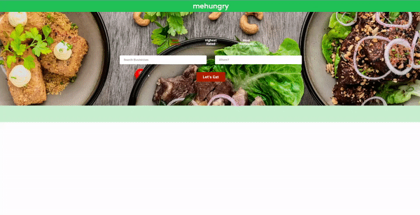

## About
This project uses Springboot, NodeJS, and ReactJS. 

Search for a place to eat if you are hungry. mehungry utilizes the Yelp Developer's API to obtain multiple restaurant search 
results based on the type of food you want to eat, and location, as well as sorting by best match, lowest price, or most reviewed. 
Each restaurant listing contains important information you would want to know such as its name, address, price range, 
phone number, and rating. 

This project gets search results from the Yelp Developer's API. To run this project, make sure that you supply your own Yelp API key in the DiningPlaceController.java which can be obtained from creating an account with Yelp Developers at [this website](https://www.yelp.com/developers).

## Front-end
1. Open a command window and goes to restaurant-search\src\main\web
2. Run "npm install"
3. Run in development mode: npm start
4. Build production bundle: npm run build     
    1. This will generate a few files under "build" directory
    2. Copy the above files to src/main/resources/public to be used by springboot server.

## Back-end
1. Run maven install
2. Start springboot server: two ways to do it
    1. java -jar restaurant-search-0.0.1-SNAPSHOT.jar
    2. In IDE, right click RestaurantSearchApplication.java to run as application.
3. Access from browser: http://localhost:8080/

*Front-end development is based on my Codeacademy project.
